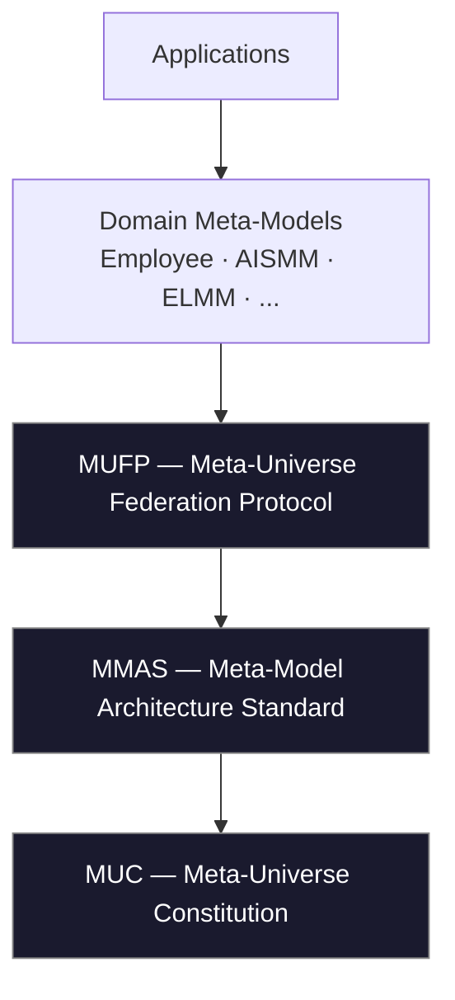
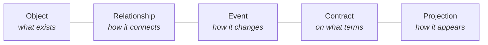

<p align="center">
  <!-- Replace with a real banner/logo when available -->
  
</p>

<h1 align="center">🌌 Meta-Universe</h1>

<p align="center"><strong>Open Standards for Federated Semantic Systems</strong></p>

<p align="center"><em>A common semantic foundation for AI, organizations, software, devices and digital ecosystems —<br>so that independent universes of meaning can understand one another without giving up their sovereignty.</em></p>

<p align="center">


</p>

<p align="center">
  <a href="#why-meta-universe">Why</a> ·
  <a href="#the-meta-universe-stack">Stack</a> ·
  <a href="#core-ideas">Core Ideas</a> ·
  <a href="#standards-family">Standards</a> ·
  <a href="#repository-map">Repository</a> ·
  <a href="#relationship-with-existing-standards">Existing Standards</a> ·
  <a href="#roadmap">Roadmap</a> ·
  <a href="#ecosystem">Ecosystem</a> ·
  <a href="#start-here">Start Here</a>
</p>

---

> 📋 **Status:** Working Draft — see [STATUS.md](STATUS.md). Not yet to be cited as a finalized standard. Machine-readable index: [`spec-index.yaml`](spec-index.yaml).

## Why Meta-Universe?

Every organization builds its own models.
Every AI system creates its own context.
Every product invents its own ontology.

Today we integrate **data**. Tomorrow we must federate **meaning**.

**Meta-Universe** is an open *family of standards* that lets independent semantic universes exchange knowledge while preserving **Identity, Context, Ownership, Trust, Traceability and Autonomy**.

It is **not** another ontology, database or platform. It is the **constitutional, architectural and federation layer** *above* existing semantic standards.

<details>
<summary><strong>Why aren't existing tools enough?</strong></summary>

| Approach | What it gives | What it misses |
|----------|---------------|----------------|
| **Graph DB** | flexible storage of nodes & edges | no sovereignty, no contracts, no projection of meaning |
| **Ontology (RDF/OWL)** | shared vocabularies | no federation lifecycle, trust model or disclosure control |
| **API (REST/GraphQL/gRPC)** | data transport | answers *how to transfer data*, not *how to agree on meaning* |
| **MDM / Data Catalog** | a single source of record | centralization; one owner of truth |

Meta-Universe answers a different question: **how can two sovereign universes safely agree on a shared understanding of knowledge?**
</details>

---

## The Meta-Universe Stack



```text
Applications
        ▲
Domain Meta-Models   (Employee, AISMM, ELMM, ...)
        ▲
MUFP   — Meta-Universe Federation Protocol
        ▲
MMAS   — Meta-Model Architecture Standard
        ▲
MUC    — Meta-Universe Constitution
```

Each layer depends only on the layers below it. Lower layers never depend on higher ones.

---

## Core Ideas

| Principle | In one line |
|-----------|-------------|
| 🌍 **Reality First** | Models describe reality rather than replace it. |
| 🆔 **Universal Identity** | Every Meta-Object has one stable, global identity. |
| 🪞 **Projection** | Each universe sees its own context-specific projection — never the raw object. |
| 🌐 **Federation** | Universes exchange projections, not ownership. |
| 🤝 **Knowledge Contracts** | Knowledge is disclosed through explicit, purpose-bound contracts. |
| 🛡️ **Trust** | Trust is established, never assumed — and never confused with security. |
| 📜 **Traceability** | Every significant fact can be traced to its origin and its lineage. |
| 🔗 **Semantic Interoperability** | Schemas are shared before data is exchanged. |

See the full [Manifesto](00-foundation/Vision.md#the-meta-universe-manifesto) and the seventeen [Principles](00-foundation/Principles.md).

---

## Standards Family

| Standard | Purpose | Status |
|----------|---------|--------|
| **MUC** — [Meta-Universe Constitution](01-constitution/Meta-Universe-Constitution.md) | The fundamental laws and invariants (21 articles, 6 chapters) | 🟧 Working Draft |
| **MMAS** — [Meta-Model Architecture Standard](02-architecture/MMAS-Core.md) | How to build, version, validate and package a meta-model | 🟧 Working Draft |
| **MUFP** — [Meta-Universe Federation Protocol](03-federation/MUFP.md) | How sovereign universes discover, trust and exchange knowledge | 🟧 Working Draft |
| **Core Concepts** — [04-core-concepts](04-core-concepts/) | The shared semantic vocabulary (Object, Relationship, Event, Contract, Projection, …) | 🟧 Working Draft |

> **Document status legend:** 🟥 Planned · 🟧 Working Draft · 🟦 Draft · 🟩 Frozen / Stable

---

## The Five Semantic Primitives



A single **Meta-Object** (a *Semantic Point of Truth*) is connected by **Relationships**, evolves through **Events**, is governed by **Contracts**, and is seen through context-specific **Projections** — all interpreted within a **Context**.

---

## Repository Map

The repository is organized **by semantics, not by file type** — each folder answers a question.

```text
00-foundation/             Why the standard exists (Vision, Principles, Terminology, Glossary, FAQ)
01-constitution/           Which laws it obeys (MUC, Governance, Change-Process, Conformance, Definitions)
02-architecture/           How meta-models are built (MMAS, Versioning, Validation, Packaging, ...)
03-federation/             How universes interact (MUFP, Trust, Identity Binding, Mapping, ...)
04-core-concepts/          The fundamental concepts (Universe, Object, Event, Projection, Context, ...)
05-reference-architecture/ How to apply it (Architecture, Stack, Patterns, Anti-Patterns, Diagrams)
06-ecosystem/              How it lives in the world (Registry, Compatibility, Certification, Roadmap)
07-guides/                 How to start (Getting-Started, Federation-Guide, AI-Agent-Guide, ...)
examples/                  How it looks in practice
LICENSE                    Apache-2.0
```

---

## Relationship with Existing Standards

Meta-Universe **unifies** rather than **replaces**. It is a layer that lets these standards coexist and federate.

| Existing standard | Meta-Universe relationship |
|-------------------|----------------------------|
| OData | imported & projected as business entities |
| RDF / OWL | imported as semantic graphs; federated, not centralized |
| Schema.org | imported as public web vocabulary |
| OpenAPI | described as a projection / service contract |
| BPMN | imported as process semantics |
| FHIR | imported as a domain (healthcare) meta-model |
| ArchiMate | imported as enterprise-architecture semantics |

External standards are imported as versioned **[Semantic Packages](02-architecture/Extension-Model.md)**, aligned through **[Semantic Mappings](03-federation/Semantic-Mapping.md)**, and composed via **[Meta-Model Composition](02-architecture/Meta-Model-Composition.md)** — the rule for when a concept is a field, a nested model, or a reference — using the **[Connector Catalogue](06-ecosystem/Connector-Catalogue.md)** as the shared set of joints between the **[1180 catalogued standards](06-ecosystem/External-Models-Registry.md)**.

---

## Roadmap

| Version | Theme |
|---------|-------|
| **v1.0 / v1.1** | First conceptual model (Universe → Dimension → Galaxy → Object → Projection) |
| **v2.0 (current)** | Full standards family: MUC + MMAS + MUFP + Core Concepts + Reference Architecture + Ecosystem + Guides |
| **Future** | Candidate standards — SVF, MMQS, SMS, MUDL, Semantic Package Registry; reference meta-models; tooling & SDKs |

See the detailed [Roadmap](06-ecosystem/Roadmap.md) and the consolidated *Candidate Future Standards*.

---

## Ecosystem

Meta-Universe is designed as a **family of repositories**:

| Repository | Purpose |
|------------|---------|
| **Meta-Universe** (this repo) | The ISO-like open standard: MUC, MMAS, MUFP, Core Concepts |
| **meta-universe-reference-models** *(planned)* | Full reference meta-models (Employee, Organization, Product, AI Agent, …) |
| [software-meta-model](https://github.com/orkestron-ai/software-meta-model) | A domain meta-model built on these standards |
| [product-landscape-meta-model](https://github.com/orkestron-ai/product-landscape-meta-model) | The federation layer above AISMM: a whole product landscape as one model |
| [meta-orchestrator-state](https://github.com/orkestron-ai/meta-orchestrator-state) | A polity modelled as one Dimension (Axiacracy / MOS): the largest known application |
| software-agents-contracts | Contract → Protocol → Deliverable specification for AI agents |

Compatible domain meta-models include AISMM, the Employee Meta-Model, the Enterprise Landscape Meta-Model and the Product Landscape Meta-Model.

Two in-depth case studies document how these concepts behave in real systems: [The Orkestron Ecosystem](06-ecosystem/Case-Study-Orkestron-Ecosystem.md) (a production ecosystem of meta-models and federated projections) and [Axiacracy / Meta-Orchestrator State](06-ecosystem/Case-Study-Axiacracy-MOS.md) (a whole state as a large meta-universe).

---

## Start Here

```text
Vision → Principles → Terminology → Glossary → Constitution → MMAS → MUFP → Core Concepts → Reference Architecture → Guides
```

1. **[Vision](00-foundation/Vision.md)** — why Meta-Universe exists (+ the Manifesto)
2. **[Principles](00-foundation/Principles.md)** — the seventeen architectural values
3. **[Terminology](00-foundation/Terminology.md)** & **[Glossary](00-foundation/Glossary.md)** — the language
4. **[Constitution (MUC)](01-constitution/Meta-Universe-Constitution.md)** — the fundamental laws
5. **[MMAS](02-architecture/MMAS-Core.md)** — how to build a meta-model
6. **[MUFP](03-federation/MUFP.md)** — how to federate
7. **[Core Concepts](04-core-concepts/)** & **[Reference Architecture](05-reference-architecture/)**
8. **[Guides](07-guides/)** — Getting Started, Federation, AI Agents, Migration

New to the project? The **[FAQ](00-foundation/FAQ.md)** answers the most common first questions.

---

## Freeze Rule

1. Documents are created in dependency order.
2. Approved documents become **Frozen**.
3. Frozen documents change only through an explicit [Change Request](01-constitution/Change-Process.md).
4. Later documents build on Frozen documents.

---

## The Vercy repository family

This repository is the standard. Around it:

| Repository | What it holds |
|---|---|
| [meta-universe](https://github.com/ver-cy/meta-universe) | The standard itself, plus the [live register of meta-models](06-ecosystem/registry/) (search, entries, registration flow) |
| [world-models](https://github.com/ver-cy/world-models) | The example catalogue: 112 vendor-neutral meta-models describing the world of people and events on Earth, each described per the standard with its own bundles and layers |
| [fcd](https://github.com/ver-cy/fcd) | Full Context Development (VC-FCD-001): every change made with full model context, every learning written back |
| [processes](https://github.com/ver-cy/processes) | The operating palette: 81 processes in 7 families that keep a Universe functioning as the digital reflection of reality, with BPMN 2.0 diagrams and worked bootstrap examples |

The map of the family and the path of a model from publication to use in another Dimension: [Vercy-Repositories](06-ecosystem/Vercy-Repositories.md).

---

## Contributing

Meta-Universe is an open specification. Contributions, reviews and proposals are welcome — start with **[CONTRIBUTING.md](CONTRIBUTING.md)**, the project **[GOVERNANCE.md](GOVERNANCE.md)**, the **[Code of Conduct](CODE_OF_CONDUCT.md)** and the **[Security Policy](SECURITY.md)**. Changes flow through the [Change Process](01-constitution/Change-Process.md); please read the [Principles](00-foundation/Principles.md) and the [Constitution](01-constitution/Meta-Universe-Constitution.md) first — every contribution must remain consistent with both.

Implementers: the **[Core Profile](02-architecture/Core-Profile.md)** defines the minimal mandatory subset to be "Meta-Universe Core conformant".

---

## License

Copyright © Orkestron.AI. Licensed under the **Apache License 2.0** — see [LICENSE](LICENSE).

---

> **Meta-Universe is a federation of sovereign semantic universes connected through shared standards, contracts and trust.**
